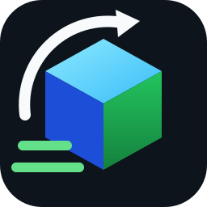

<p align="center">
  
</p>

<h1 align="center">MaxFastBuild</h1>

<p align="center">
  <strong>Server-authoritative mass building for Minecraft Java 26.2</strong><br>
  Fabric client · Paper/Leaf plugin · command + chat protocol (no custom payload)
</p>

<p align="center">
  <a href="LICENSE"></a>
  
  
  
  
</p>

<p align="center">
  <a href="docs/USER_MANUAL_en_US.md">English manual</a> ·
  <a href="docs/USER_MANUAL_zh_CN.md">简体中文手册</a> ·
  <a href="docs/architecture.md">Architecture</a> ·
  <a href="docs/protocol.md">Protocol</a> ·
  <a href="docs/configuration.md">Configuration</a>
</p>

---

## Features

- **Radial build menu** (hold key, release to select) with place / break by held item
- **Server-authoritative shapes** — client sends anchors only; server regenerates and validates
- **Economy** (Vault) + **materials** (inventory / optional shulker boxes)
- **Tool-aware breaking** with durability floor and effective-tool checks
- **CoreProtect** logging under the player name (when the API is available)
- **Partial refunds** for unfinished per-block / per-area charges

### Build modes

| | | | |
|:---:|:---:|:---:|:---:|
|  Single |  Line |  Wall |  Floor |
|  Cube |  D-Line |  D-Wall |  Slope |
|  Circle |  Cylinder |  Sphere |  Pyramid |
|  Cone | | | |

## Modules

| Module | Role |
|--------|------|
| `maxfastbuild-api` | Platform-neutral contracts |
| `maxfastbuild-core` | Shapes, billing, protocol, tasks |
| `maxfastbuild-storage` | SQLite tasks / ledger / escrow |
| `maxfastbuild-fabric` | Fabric 26.2 client (+ optional server entry) |
| `maxfastbuild-paper` | Paper/Leaf 26.2 plugin (Vault, CoreProtect) |

## Requirements

- **Java 25**
- **Minecraft 26.2**
- Client: Fabric Loader **≥ 0.19.3**, Fabric API **≥ 0.155.2+26.2**
- Server: Paper/Leaf **26.2** (or compatible) + this plugin

## Build

```bash
./gradlew build
```

Artifacts:

- **Release folder (preferred):** `release/MaxFastBuild-Paper-<version>.jar`, `release/MaxFastBuild-Fabric-<version>.jar`  
  Filled automatically by `./gradlew build` (`copyReleaseJars`).
- **Local Leaf test server:** if `../test-server-leaf/` exists, Paper jar is also copied to  
  `../test-server-leaf/plugins/MaxFastBuild.jar` (`deployPaperToLeaf`, after `:maxfastbuild-paper:jar` / `build`).
- Module outputs: `maxfastbuild-paper/build/libs/`, `maxfastbuild-fabric/build/libs/`

```powershell
./gradlew build
# or only plugin + deploy:
./gradlew :maxfastbuild-paper:jar deployPaperToLeaf
```

## Install (quick)

1. Put the **Paper plugin** jar in the server `plugins/` folder.
2. Put the **Fabric client** jar (and Fabric API) in the client `mods/` folder.
3. Configure `plugins/MaxFastBuild/config.yml` (economy, CoreProtect, shulkers, limits).
4. Restart the server; join with the client mod.

Player controls and workflows: [English](docs/USER_MANUAL_en_US.md) / [中文](docs/USER_MANUAL_zh_CN.md).

## Internationalization (i18n)

| Surface | Files |
|---------|--------|
| Fabric client UI / HUD / errors | `maxfastbuild-fabric/.../lang/en_us.json`, `zh_cn.json` |
| Paper message templates (not loaded yet; protocol keys + hard-coded admin strings) | `maxfastbuild-paper/.../messages_en_us.yml`, `messages_zh_cn.yml` |
| Player manuals | `docs/USER_MANUAL_en_US.md`, `docs/USER_MANUAL_zh_CN.md` |

Protocol responses use translation keys (e.g. `maxfastbuild.task.accepted`); the client resolves them with language files.

## Protocol (summary)

Client → server (no custom channel):

```text
/__mfb place <mode> x1 y1 z1 x2 y2 z2 hollow material
/__mfb break <mode> x1 y1 z1 x2 y2 z2 hollow
```

Server → client: system chat marked with `U+2063MFB1:` + JSON (`messageKey` + `data`).

Details: [docs/protocol.md](docs/protocol.md).

## License

**LGPL-3.0-only** — see [LICENSE](LICENSE) and [NOTICE](NOTICE).

Interaction concepts inspired by [Effortless Building](https://github.com/Requios/effortless-building-multi) (Requios) and related work; MaxFastBuild uses a separate transport, billing, persistence, and audit design.

## Contributing

See [CONTRIBUTING.md](CONTRIBUTING.md). Please use [Conventional Commits](https://www.conventionalcommits.org/).
