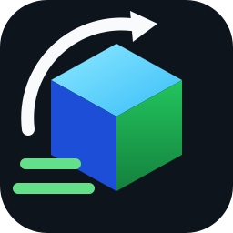

# MaxFastBuild User Manual



Player-facing guide. Server configuration, permissions, and operations are documented separately for administrators.

## Requirements

- Minecraft Java Edition **26.2**
- **Fabric Loader** and **Fabric API** (versions matching 26.2)
- A server running **MaxFastBuild** (players only need the client mod)

## Client install

Put the client jar and Fabric API in the instance `mods` folder, then join a server that supports the mod.

## Radial menu

1. **Hold** the bind (default **Left Alt**, rebind under Options → Controls → MaxFastBuild); **release to close**.
2. Move over a sector to highlight; **release** or **left-click** to select.
3. The menu is transparent so the world stays visible.

## Place and break

| Main hand | Mode |
|-----------|------|
| Placeable block | **Place** |
| Pickaxe / axe / shovel / hoe / sword / shears | **Break** (must be effective for the block; e.g. obsidian needs a proper pick) |
| Empty hand, bow, other items | **No mode** |

### Selection

1. Pick a shape from the radial menu.
2. **Right-click** first corner, **right-click** second corner to submit.
3. **Left-click** cancels the selection.
4. Corners may be in air; against a solid block, place uses vanilla replaceable/adjacent rules.
5. **Shift+scroll** sets look depth **1–64**; plain scroll still changes the hotbar.
6. Preview shows only the shape **shell** plus a bounds outline.

### Costs and materials (server-defined)

- **Place** (survival): consumes matching blocks from the inventory; may charge economy if enabled. Insufficient items or balance rejects the request.
- **Break**: normal drops and tool wear; a tool is never worn below **4** remaining durability—other inventory tools are used next.
- **Partial completion**: unfinished mutations refund variable per-block/per-area fees and unused place materials. A fixed per-operation fee (if enabled) is generally kept once execution has started.

## Shapes

Single, line, wall, floor, cube, diagonal line, diagonal wall, slope floor, circle, cylinder, sphere, pyramid, cone.

## Without the client mod

Public server commands (permission `maxfastbuild.use`). Use `/mfb` or `/mfb help` for help (server default language is Chinese unless `default-language` is changed).

```text
/mfb help
/mfb mode line
/mfb pos1
/mfb pos2
/mfb hollow false
/mfb apply
/mfb status
/mfb cancel
```

`apply` matches the client: main-hand block = place/replace, mining tool = break, empty hand = reject (material comes from the held block).

## Troubleshooting

- **Menu does not open**: check key conflicts; confirm the client mod and server version.
- **Cannot pick**: select a mode first; hold a block or tool.
- **Insufficient materials**: you need at least as many blocks as the shape will place.
- **Payment failed**: not enough balance or economy unavailable.
- **Partial refund message**: normal when some blocks could not be applied.
